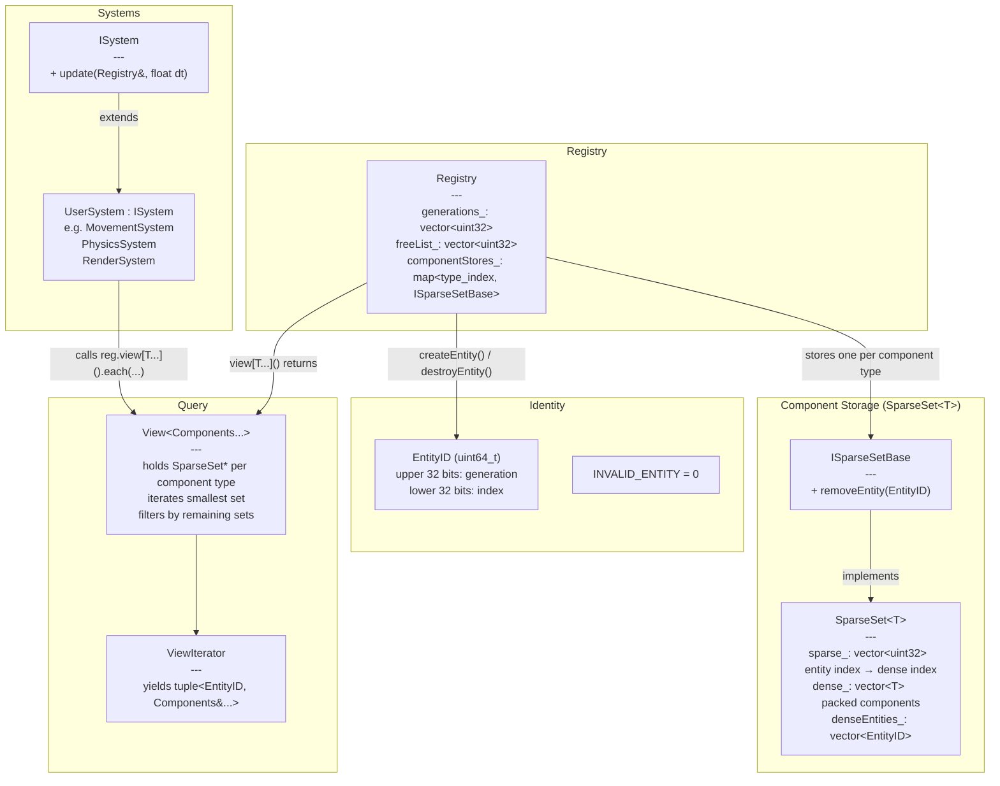
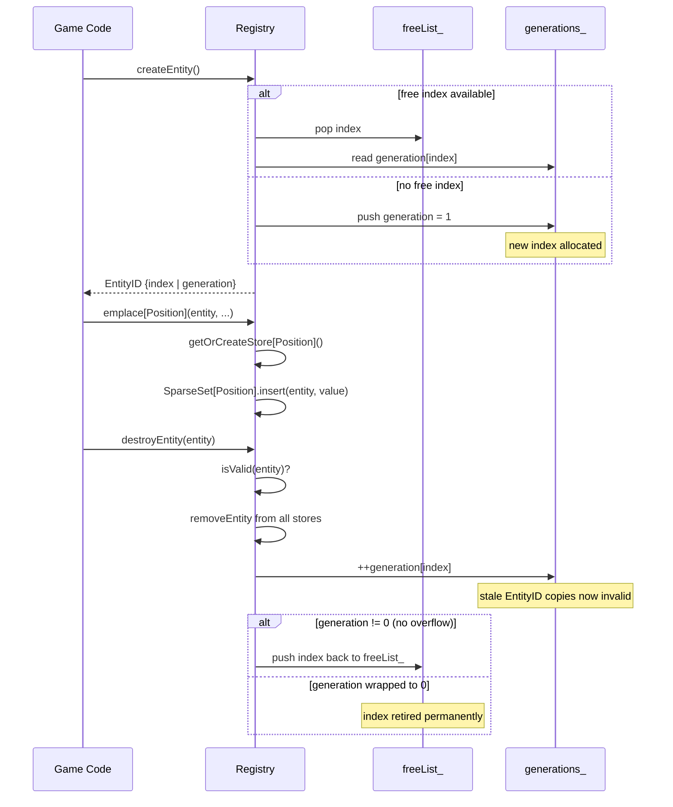
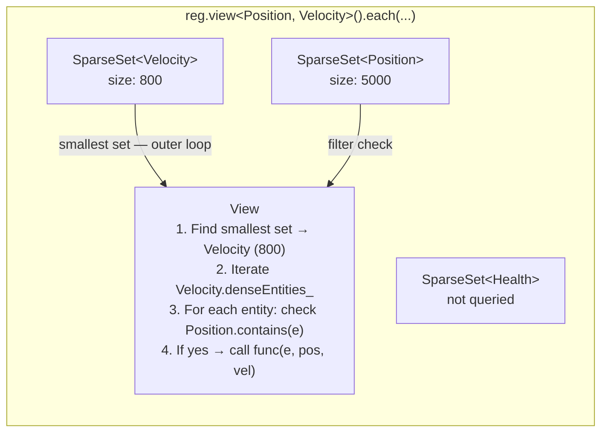
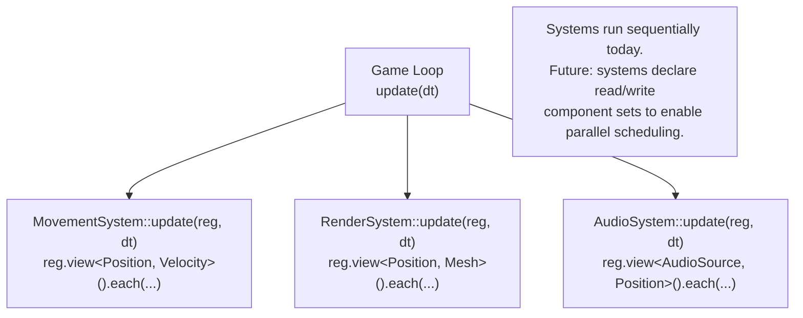

# ECS Architecture

## Overview

The ECS is structured as three layers: **identity** (entities), **storage** (sparse sets), and **orchestration** (registry, views, systems).

---

## Core Structure



---

## Entity Lifecycle



---

## Sparse Set Layout (SoA)

Each component type has its own `SparseSet<T>` — this is the SoA (Struct of Arrays) layout. The sparse and dense arrays work together to maintain O(1) insert, remove, and lookup while keeping component data packed for cache-friendly iteration.

```
Entity indices:    0     1     2     3     4     5
                   ┌─────┬─────┬─────┬─────┬─────┬─────┐
sparse_:           │  2  │  ∅  │  0  │  1  │  ∅  │  3  │   entity index → dense index
                   └─────┴─────┴─────┴─────┴─────┴─────┘
                     ↓              ↓    ↓              ↓
Dense index:         2              0    1              3
                   ┌─────┬─────┬─────┬─────┐
dense_:            │ C2  │ C0  │ C3  │ C5  │   packed component values (T)
denseEntities_:    │ E2  │ E0  │ E3  │ E5  │   parallel: which entity owns each slot
                   └─────┴─────┴─────┴─────┘

Each component type (Position, Velocity, Health...) has its own independent SparseSet.
Iteration over components_ is a tight loop over a packed array — no pointer chasing.
```

**Remove (swap-and-pop):** When removing entity E3 (dense index 1), the last element (E5, dense index 3) is swapped into slot 1, and `sparse_[5]` is updated to 1. The arrays shrink by one. O(1).

---

## View Query (Multi-Component Iteration)



A null store pointer (component type never used) is treated as size 0 — the view immediately yields zero entities with no side effects.

---

## System Execution Model



Systems are independent units that query the registry via views. The current model runs them sequentially. The design anticipates future system-level parallelism by keeping systems stateless with respect to each other — they only communicate through components in the registry.

---

## File Structure

```
engine/ecs/
├── Entity.h          EntityID type, index/generation packing utilities
├── SparseSet.h       ISparseSetBase + SparseSet<T> template
├── Registry.h        Registry class (entity lifecycle, component management, view factory)
├── Registry.cpp      createEntity, destroyEntity, isValid implementations
├── View.h            View<Components...> + ViewIterator templates
└── System.h          ISystem abstract base

tests/ecs/
├── TestEntity.cpp    Entity ID packing/unpacking, edge cases
├── TestSparseSet.cpp Insert, remove, swap-and-pop, spans, clear, stress
├── TestRegistry.cpp  Entity lifecycle, component CRUD, generation safety, stress
└── TestView.cpp      Single/multi-component iteration, mutations, range-for, 10k stress
```

---

## Key Design Properties

| Property | How it's achieved |
|---|---|
| O(1) component insert/remove | Sparse set swap-and-pop |
| Cache-friendly iteration | Packed dense arrays per component type (SoA) |
| Stale ID detection | Generation counter in upper 32 bits of EntityID |
| Generation overflow safety | Index retired permanently if generation wraps to 0 |
| No empty-store side effects | `view()` passes null for unused component types; View handles null as empty |
| Type safety | `std::type_index` keyed map, static_cast inside Registry |
| Zero dependencies | Pure C++20 stdlib only |
