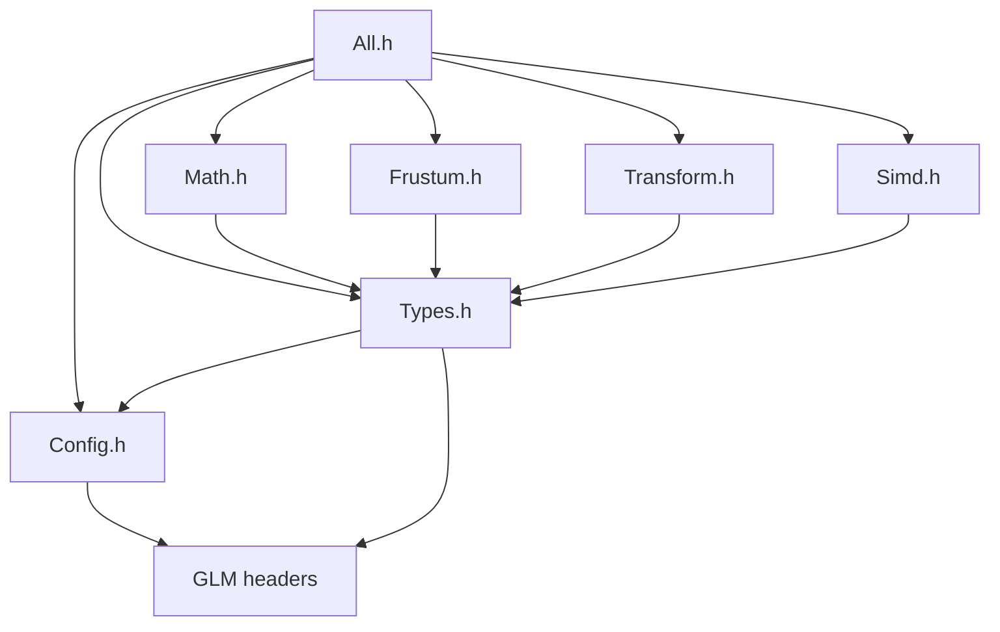
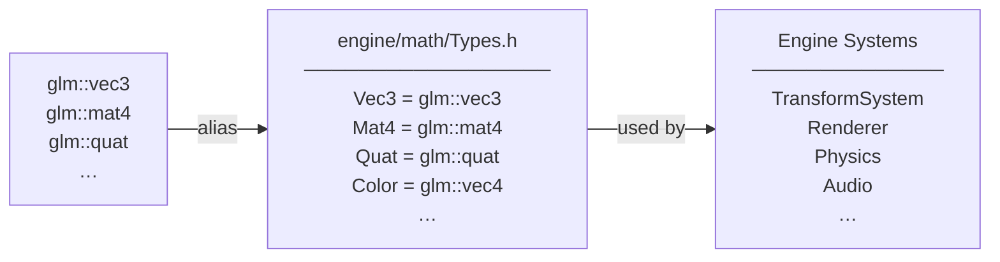
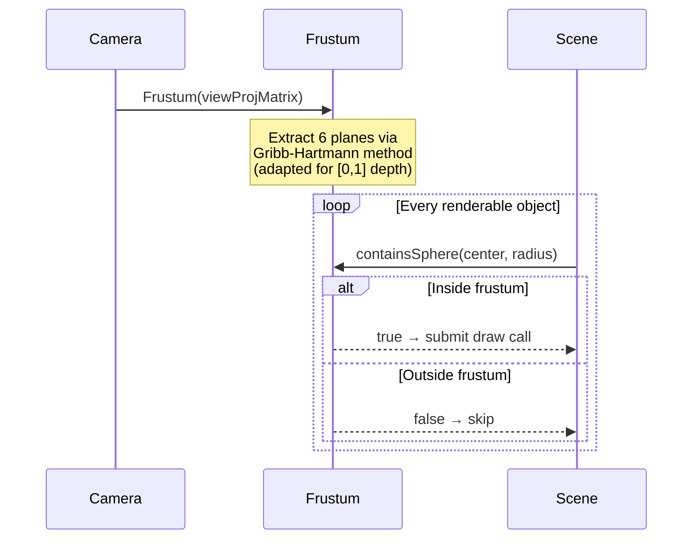
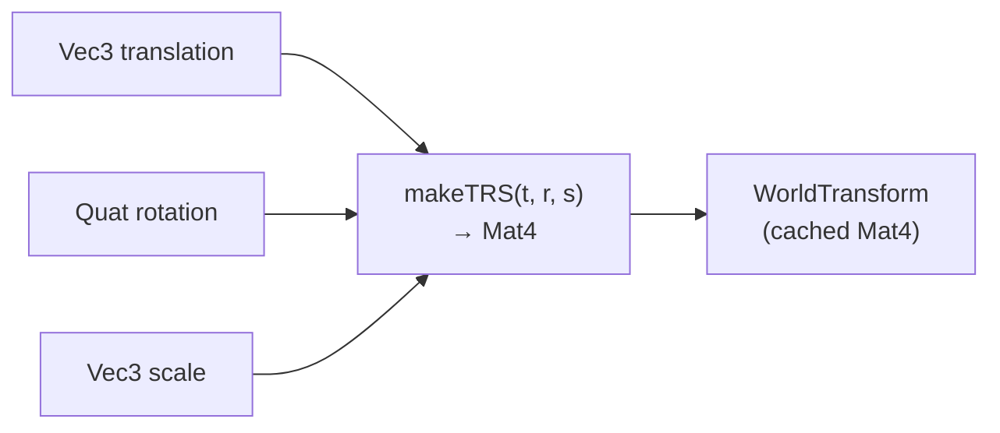
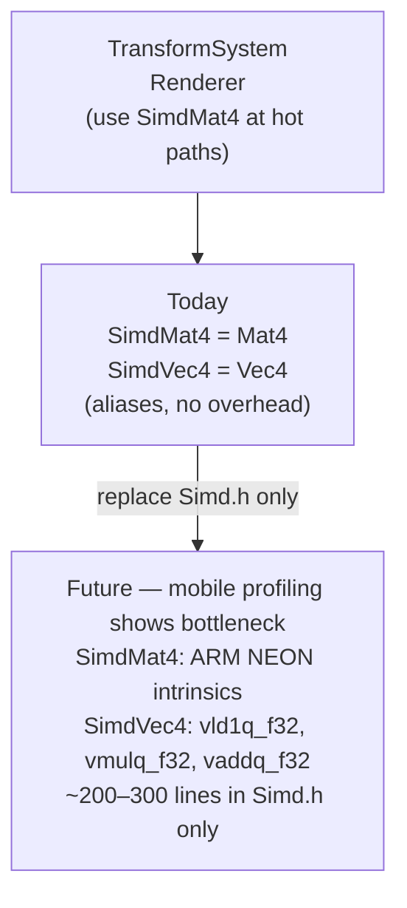

# Math Library Architecture

The math layer is a thin, zero-cost abstraction over GLM. All engine code goes through type aliases and utility headers — no code ever references `glm::` types directly. This keeps GLM swappable with a one-file change and enforces a consistent API across the engine.

---

## File Layout

```
engine/math/
├── Config.h      — GLM compile flags (included first, before any GLM header)
├── Types.h       — All type aliases (Vec2/3/4, Mat3/4, Quat, IVec2, Color…)
├── Math.h        — Constants + free utility functions (lerp, clamp, remap…)
├── Frustum.h     — Frustum struct + sphere/AABB containment (camera culling)
├── Transform.h   — TRS helpers (makeTranslation, makeTRS, decomposeTRS…)
├── Simd.h        — SimdMat4/SimdVec4 stubs (placeholder for future NEON layer)
└── All.h         — Convenience umbrella: includes all of the above
```

Most engine code only needs `#include "engine/math/All.h"`.

---

## Include Dependency Graph



`Config.h` must be included before any GLM header to guarantee all compile flags take effect. `Types.h` includes `Config.h` as its first line, so everything downstream is automatically covered.

---

## Type Alias Flow

All engine code uses aliases. GLM types never appear in engine headers.



**Swapping GLM:** Change the `using` declarations in `Types.h`. Nothing else changes.

---

## GLM Compile Flags (Config.h)

| Flag | Effect | Why |
|---|---|---|
| `GLM_FORCE_INTRINSICS` | Enables SSE2/AVX on x86/x64 | Free perf on Windows/Mac desktop, no code changes |
| `GLM_FORCE_DEPTH_ZERO_TO_ONE` | Depth range [0,1] | bgfx/Vulkan NDC, not OpenGL [-1,1] |
| `GLM_FORCE_RADIANS` | Disables degree overloads | Eliminates degree/radian bugs engine-wide |
| `GLM_FORCE_XYZW_ONLY` | Disables `.r .g .b` swizzles | Vectors are positions/directions — use `.x .y .z` consistently |

---

## Frustum Culling Pipeline

The frustum is rebuilt from the view-projection matrix every frame and tested against every visible object. This is the highest-frequency math path in the engine.



**Plane extraction (Gribb-Hartmann, [0,1] depth):**

For a combined view-projection matrix M with rows r0..r3:

| Plane | Formula |
|---|---|
| Left | r3 + r0 |
| Right | r3 − r0 |
| Bottom | r3 + r1 |
| Top | r3 − r1 |
| Near | r2 (Vulkan/[0,1] only) |
| Far | r3 − r2 |

**AABB test — positive vertex method:** For each plane, compute the corner of the AABB most in the direction of the plane normal. If that corner is outside, the entire box is outside. O(6) operations per AABB.

---

## Transform Composition (Transform.h)

Used by `TransformSystem` to recompute world matrices for dirty scene graph nodes.



`decomposeTRS` is the inverse — extracts translation, rotation, and scale from an existing matrix. Used by the editor inspector to display editable fields for a selected entity's transform.

---

## SIMD Upgrade Path (Simd.h)

The SIMD layer is a planned future addition, not implemented now. The file exists as a stub so call sites can opt in early.



**Trigger condition:** Mobile profiling shows `TransformSystem` world matrix updates are a measurable bottleneck. Before that point, `GLM_FORCE_INTRINSICS` provides SIMD on x86/x64 for free.

**Hot paths that benefit most:**
- `Mat4` multiply in `TransformSystem` (world matrix recompute for dirty nodes)
- `Vec4` arithmetic in the renderer (light accumulation, vertex transform)
- Frustum AABB tests (6 plane dot products per object)
- `Quat` operations in animation sampling

---

## Test Coverage

| Test file | What it covers |
|---|---|
| `tests/math/TestMath.cpp` | Constants, lerp, clamp, saturate, remap, smoothstep, toRadians/toDegrees, approxEqual, isPowerOfTwo, nextPowerOfTwo |
| `tests/math/TestFrustum.cpp` | Frustum construction from VP matrix, sphere inside/outside, AABB inside/outside, edge cases (sphere touching plane, zero-size AABB) |
| `tests/math/TestTransform.cpp` | makeTranslation, makeScale, makeRotation, makeTRS composition, decomposeTRS round-trip, identity matrix |
