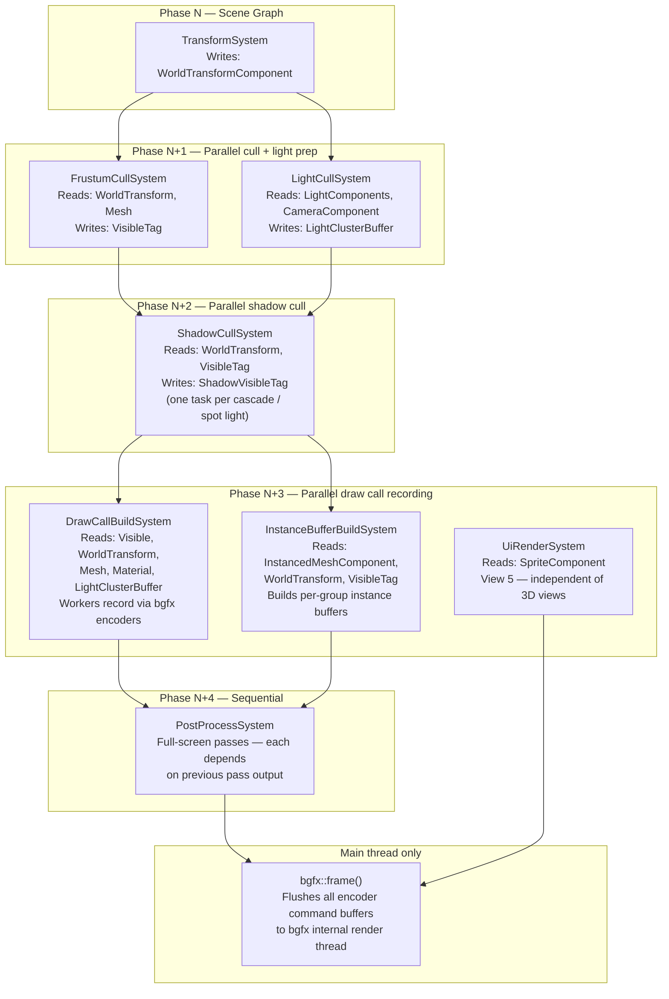
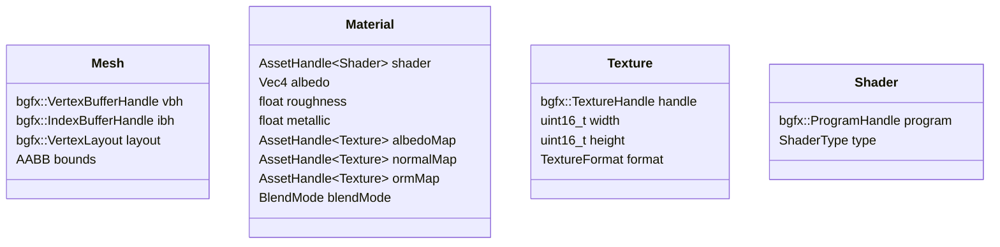
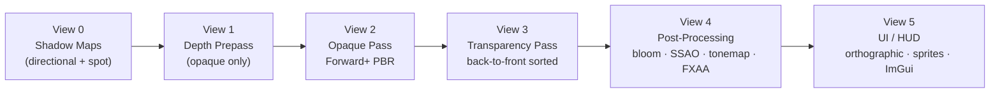
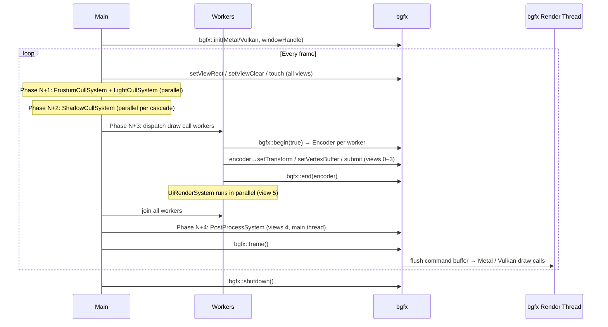
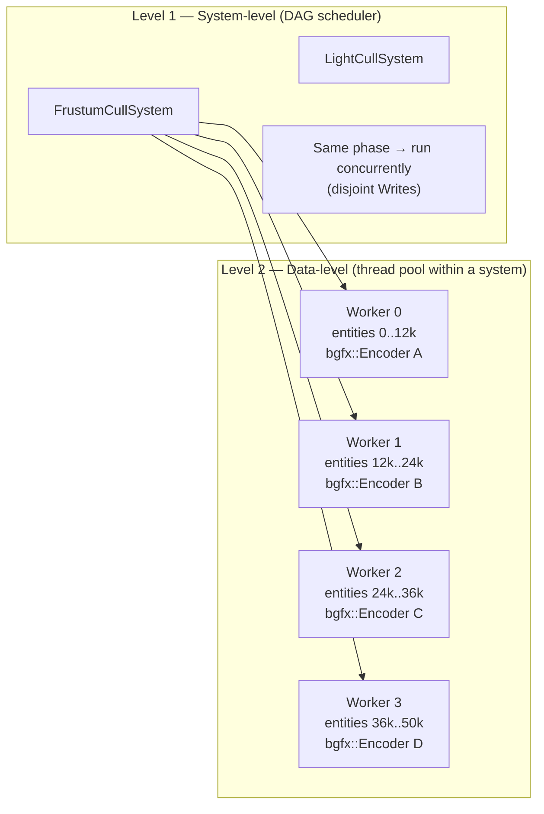
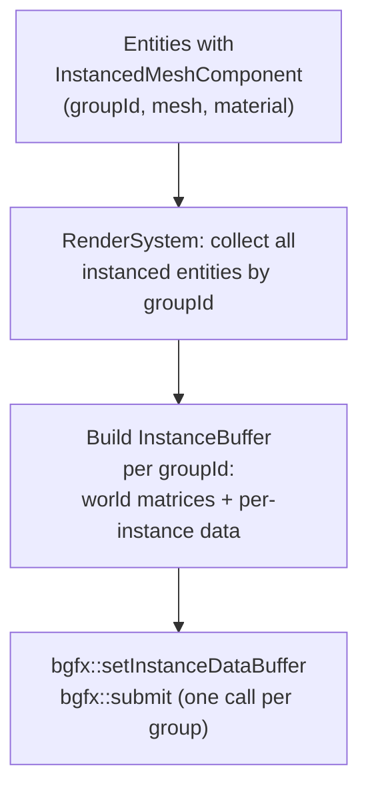
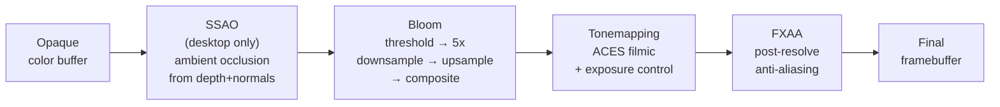

# Rendering Architecture

The renderer sits on top of **bgfx** (Metal + Vulkan backends only) and is driven by the ECS. It is not a self-contained subsystem — it is a set of systems and components that live in the same registry as everything else. The work is split across several focused systems that execute in ECS phases: transforms are updated, then visibility is culled and lights are assigned in parallel, then draw calls are recorded in parallel using bgfx encoders, then post-processing runs sequentially. bgfx's internal render thread consumes the resulting command buffer independently.

---

## Design Principles

- **ECS-driven.** Everything renderable is an entity with components. There is no separate scene representation.
- **Forward+.** Tiled clustered forward shading. Handles many dynamic lights, supports transparent objects naturally, works on mobile.
- **No render graph (yet).** Passes are a hardcoded linear pipeline. A proper render graph is the natural next step when the pipeline grows beyond ~6 passes — noted as a future upgrade.
- **PBR materials.** Physically-based rendering (albedo, roughness, metallic, normal, AO). One material format engine-wide.
- **bgfx views = passes.** Each render pass is a bgfx view. View IDs are fixed constants so pass ordering is explicit and easy to change.
- **Assets behind handles.** All GPU resources (meshes, textures, materials, shaders) are referenced by a typed `AssetHandle<T>`. The `RenderResources` registry maps handles to live bgfx handles.
- **Two levels of parallelism.** System-level: non-conflicting render systems run concurrently via the DAG scheduler. Data-level: individual systems (frustum cull, draw call recording) split their work across thread pool workers. bgfx encoders allow multiple threads to record draw calls simultaneously.

---

## System Overview

The render workload is split across five systems that map onto ECS phases. The DAG scheduler serializes phases with data dependencies and runs independent systems within a phase in parallel.



`FrustumCullSystem` and `LightCullSystem` have disjoint Writes so the DAG scheduler places them in the same phase and runs them concurrently. `UiRenderSystem` targets a different bgfx view and has no data conflict with `PostProcessSystem`, so they also run in parallel.

Within `FrustumCullSystem` and `DrawCallBuildSystem`, the thread pool is used for data-level parallelism — entity lists are partitioned across workers for culling and draw call encoding respectively.

---

## ECS Components

```mermaid
classDiagram
    class CameraComponent {
        ProjectionType type
        float fovY
        float nearPlane
        float farPlane
        float aspectRatio
        uint8_t viewLayer
    }

    class MeshComponent {
        AssetHandle~Mesh~ mesh
    }

    class MaterialComponent {
        AssetHandle~Material~ material
    }

    class DirectionalLightComponent {
        Vec3 direction
        Vec3 color
        float intensity
        bool castShadows
    }

    class PointLightComponent {
        Vec3 color
        float intensity
        float radius
    }

    class SpotLightComponent {
        Vec3 direction
        Vec3 color
        float intensity
        float innerAngle
        float outerAngle
        float radius
    }

    class InstancedMeshComponent {
        AssetHandle~Mesh~ mesh
        AssetHandle~Material~ material
        uint32_t instanceGroupId
    }

    class VisibleTag {
        +empty tag component
    }

    class ShadowVisibleTag {
        uint8_t cascadeMask
    }
```



**Renderable entity** = `MeshComponent` + `MaterialComponent` + `WorldTransformComponent`.
**Camera entity** = `CameraComponent` + `WorldTransformComponent`.
**Light entity** = one of the light components.

`WorldTransformComponent` is written by `TransformSystem` (scene graph). All render systems read it — no transform logic lives in the renderer.

`VisibleTag` is added/removed by `FrustumCullSystem` each frame. `DrawCallBuildSystem` only processes entities that carry it — entities outside the frustum are never touched by the draw call path. `ShadowVisibleTag.cascadeMask` is a bitmask (bit 0 = cascade 0, etc.) set by `ShadowCullSystem`; shadow draw calls are only recorded for entities with the relevant bit set.

---

## Asset Types



All assets are loaded through the `AssetSystem` (streaming / asset cache layer). The `RenderResources` registry holds the live bgfx handles; assets themselves store metadata only.

---

## Render Pipeline



### View 0 — Shadow Maps

- One shadow map per directional light (CSM — 3 cascades), one per active spot light.
- Resolution: 2048² directional, 1024² spot (configurable).
- Depth-only render: no color attachment.
- Output: shadow map textures sampled in the opaque pass.

### View 1 — Depth Prepass

- Renders only opaque geometry to populate the depth buffer.
- Eliminates overdraw in the opaque pass (especially important for dense foliage/terrain).
- Can be disabled on mobile if the prepass cost exceeds the overdraw cost (GPU-dependent, profile-driven).

### View 2 — Opaque Pass (Forward+)

- All opaque, non-instanced geometry.
- Light data passed as a uniform buffer (point/spot lights, up to 256 active lights).
- Clustered culling: view frustum divided into a 3D grid of tiles; each tile knows which lights affect it. Computed once on CPU per frame before submission.
- Reads shadow maps from View 0 for shadow-receiving surfaces.
- PBR shader: GGX specular, Lambert diffuse, IBL ambient, shadow PCF.

### View 3 — Transparency Pass

- Alpha-blended and alpha-tested geometry.
- Sorted back-to-front by depth (camera distance) each frame.
- No depth writes. Reads depth buffer from View 1/2 for soft particle depth tests.

### View 4 — Post-Processing Chain

Each post effect is a full-screen quad blit in its own sub-pass (or chained into a single shader):

| Effect | When | Notes |
|---|---|---|
| SSAO | optional, desktop only | Reconstructed from depth + normals |
| Bloom | always | Threshold → downsample → upsample → composite |
| Tonemapping | always | ACES filmic |
| FXAA | always | Temporal AA deferred to future |

### View 5 — UI / HUD

- Orthographic projection. All 2D sprites and UI panels render here.
- ImGui rendered last in this pass (editor mode) or suppressed (shipped game).
- Depth test disabled — UI always draws on top.

---

## bgfx Integration



### bgfx Encoder Rules

bgfx encoders allow worker threads to record draw calls concurrently into separate command buffers that bgfx merges before `bgfx::frame()`.

| Operation | Thread | Reason |
|---|---|---|
| `bgfx::init` / `bgfx::shutdown` | Main only | One-time lifecycle |
| `bgfx::frame()` | Main only | Synchronization point |
| `bgfx::setViewRect` / `setViewClear` / `touch` | Main only | View state is global |
| GPU resource creation (`createVertexBuffer`, `createTexture`, …) | Main only | bgfx resource API not thread-safe |
| `bgfx::begin(true)` / encoder calls / `bgfx::end` | Any worker thread | Safe — each encoder is independent |
| Post-process full-screen submits (views 4) | Main thread encoder | Sequential dependency on prior passes |

---

## Threading Model

### Two Levels of Parallelism



**Level 1** is handled by the DAG scheduler automatically from the Reads/Writes declarations on each system. No manual coordination needed — systems with disjoint writes land in the same phase and run on separate thread pool threads.

**Level 2** is explicit within a system. `FrustumCullSystem` and `DrawCallBuildSystem` partition their entity lists into N chunks (N = thread count) and submit tasks to the `ThreadPool`. Each draw call worker holds its own `bgfx::Encoder` for the duration of its task.

### What Is and Isn't Parallelized

| Work | Parallel? | How |
|---|---|---|
| Frustum cull (main camera) | Yes | Data-parallel — entity list split across workers |
| Shadow frustum cull | Yes | One task per cascade + spot light (system-level) |
| Clustered light list building | Yes | Data-parallel — tile grid split across workers |
| Instance buffer construction | Yes | One task per instance group |
| Draw call recording (opaque, shadow, transparent) | Yes | N workers, each with a bgfx::Encoder |
| Post-processing passes | No | Each pass reads the previous pass output |
| UI / sprite rendering | Yes (with post-process) | Different bgfx view — no data conflict |
| GPU resource upload (mesh, texture) | No | bgfx resource API is main-thread only; use staging queue |
| bgfx::frame() | No | Main-thread synchronization point |

### Staging Queue for Async Asset Upload

GPU resource creation (`bgfx::createVertexBuffer`, `bgfx::createTexture`) is main-thread only. When the asset system finishes loading a mesh or texture on a background thread, it pushes a `PendingUpload` to a thread-safe queue. At the start of each frame (before view setup), the main thread drains this queue and calls the bgfx create functions. This keeps worker threads free of main-thread-only bgfx calls while still feeding the GPU promptly.

### Platform-specific init:

| Platform | Backend | Window handle |
|---|---|---|
| Mac | Metal | `NSWindow*` (wrapped in `bgfx::PlatformData`) |
| iOS | Metal | `CAMetalLayer*` |
| Windows | Vulkan | `HWND` |
| Android | Vulkan | `ANativeWindow*` |

---

## Shader Pipeline

bgfx uses **shaderc** — shaders are written in a GLSL-like dialect and compiled offline to Metal Shader Language (Metal) or SPIR-V (Vulkan). No runtime compilation.

```
engine/rendering/shaders/
├── common/
│   ├── uniforms.sh       — shared uniform declarations
│   └── pbr.sh            — PBR lighting functions (GGX, Lambert, IBL)
├── pbr/
│   ├── vs_pbr.sc         — PBR vertex shader
│   └── fs_pbr.sc         — PBR fragment shader
├── shadow/
│   ├── vs_shadow.sc      — depth-only vertex shader
│   └── fs_shadow.sc      — depth-only fragment shader (empty)
├── post/
│   ├── vs_fullscreen.sc  — full-screen triangle vertex shader
│   ├── fs_bloom.sc
│   ├── fs_ssao.sc
│   ├── fs_tonemap.sc
│   └── fs_fxaa.sc
└── ui/
    ├── vs_sprite.sc
    └── fs_sprite.sc
```

**Build step:** A CMake custom command runs shaderc on all `.sc` files and outputs compiled shader binaries into `assets/shaders/`. The engine loads these binaries at startup via the asset system. Shaders are never compiled at runtime.

**Platform targets compiled per shader:**
- `--platform osx --type metal` → `.bin` for Metal
- `--platform android --type spirv` → `.bin` for Vulkan

Both are packaged and the engine selects the correct binary based on the active bgfx backend.

---

## GPU Instancing

For vegetation, foliage, rocks, and other high-count repeated meshes. A single draw call renders thousands of instances.



- Instances are grouped by `(mesh, material)` pair — one draw call per unique pair.
- The instance buffer is rebuilt from ECS data each frame (dynamic, CPU-side).
- Buffer construction is parallel: `InstanceBufferBuildSystem` submits one thread pool task per group — groups are fully independent.
- Once GPU-driven culling is needed (1M+ instances), this becomes a compute shader — noted as future work.

---

## Lighting Model

**Ambient:** Image-based lighting (IBL) — a prefiltered environment cubemap + BRDF LUT. One IBL per scene; blended between two IBLs in transition zones.

**Directional:** Sun light. One per scene. Casts cascaded shadow maps (3 cascades, configurable split lambda).

**Point / Spot:** Dynamic, clustered. Up to 256 active lights total. The clustered grid is 16×9×24 tiles (matches 16:9 viewport, 24 depth slices). Per-tile light lists are computed on CPU and uploaded as a uniform buffer before the opaque pass.

**Emissive:** Materials can have an emissive color + intensity. No light is emitted (no lightmaps), purely a visual additive contribution.

**Future — lightmaps / light probes:** Static geometry can be baked offline and stored as light probe volumes. Not in scope for the initial renderer.

---

## Post-Processing



Each effect is a full-screen pass. The chain is configurable at runtime (effects can be toggled via the in-game visualiser). On mobile, SSAO is disabled by default.

---

## 2D / UI Layer (View 5)

Rendered last, on top of everything. Orthographic projection — no depth test.

**Sprites:** A sprite is a quad mesh (two triangles) with a texture region. The `SpriteComponent` holds a texture handle + UV rect. `SpriteRenderSystem` batches all sprites sharing the same texture atlas into a single draw call per atlas.

**ImGui:** Rendered in View 5 in editor mode. In shipped builds, the ImGui render step is compiled out (`#ifndef NIMBUS_EDITOR`).

---

## RenderResources Registry

Maps typed asset handles to live bgfx handles. Owns all GPU resource lifetime.

```cpp
// engine/rendering/RenderResources.h
class RenderResources
{
public:
    bgfx::VertexBufferHandle  getMesh(AssetHandle<Mesh>) const noexcept;
    bgfx::TextureHandle       getTexture(AssetHandle<Texture>) const noexcept;
    bgfx::ProgramHandle       getShader(AssetHandle<Shader>) const noexcept;

    void uploadMesh(AssetHandle<Mesh>, const MeshData&);
    void uploadTexture(AssetHandle<Texture>, const TextureData&);
    void uploadShader(AssetHandle<Shader>, const ShaderData&);

    void release(AssetHandle<Mesh>);
    void release(AssetHandle<Texture>);
    void release(AssetHandle<Shader>);
};
```

Called by the asset system when a mesh/texture/shader finishes loading. Release called when the asset is evicted from the cache.

---

## Draw Call Sort Order

Within each pass, draw calls are sorted to minimise GPU state changes:

**Opaque pass sort key (64-bit, most significant first):**
1. Shader program ID — state changes are most expensive
2. Texture set hash — texture binding changes
3. Depth (front-to-back) — early-z rejection (less important after depth prepass, still useful)

**Transparency pass sort key:**
1. Depth (back-to-front) — required for correct blending

bgfx accepts a 64-bit sort key on `bgfx::submit()`; we pack our sort key into it directly.

---

## Implementation Plan

The renderer is built in phases, each independently shippable:

| Phase | What | Dependency |
|---|---|---|
| 1 | bgfx init + window integration, clear screen | Platform layer |
| 2 | Mesh upload, unlit draw call, camera | Math library ✓ |
| 3 | PBR material + directional light (no shadows) | Phase 2 |
| 4 | Shadow maps (directional, single cascade) | Phase 3 |
| 5 | Instanced mesh rendering | Phase 2 |
| 6 | Point + spot lights (clustered) | Phase 3 |
| 7 | Post-processing (bloom, tonemap, FXAA) | Phase 3 |
| 8 | SSAO | Phase 7 |
| 9 | CSM (3-cascade shadows) | Phase 4 |
| 10 | 2D sprite batching + UI pass | Phase 2 |
| 11 | IBL (environment cubemap) | Phase 3 |

---

## Open / Deferred Decisions

| Topic | Decision |
|---|---|
| Render graph | Hardcoded linear pipeline for now; render graph when pass count or resource dependencies become unwieldy |
| TAA (Temporal Anti-Aliasing) | Deferred — requires jitter + reprojection; FXAA ships first |
| Decals | Not in initial scope |
| Terrain renderer | Separate concern — heightfield + clipmap LOD; design when first game needs it |
| GPU-driven rendering (compute culling, indirect draw) | Future — triggers when instanced mesh count exceeds ~100k and CPU bottleneck is confirmed |
| Lightmaps / light probes | Deferred — static bake pipeline is significant work; dynamic lights only first |
| Ray tracing | Long-term — tabled (see NOTES.md Rendering section) |
