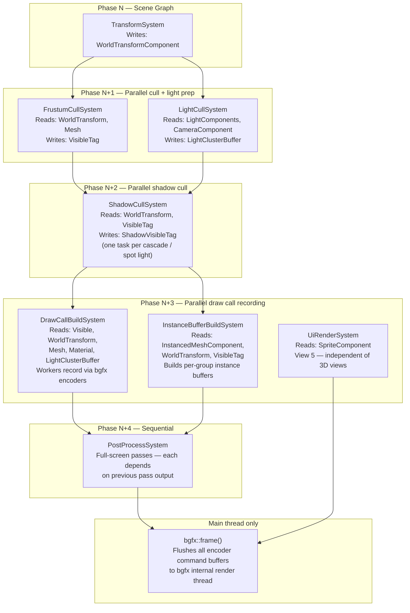
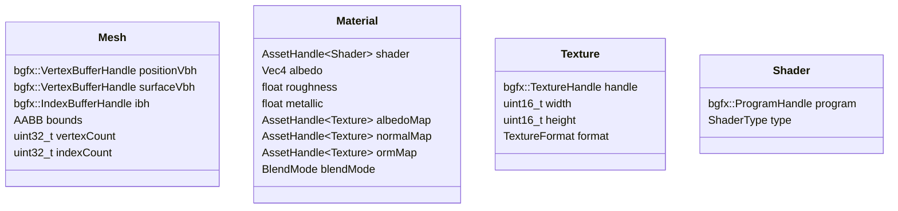
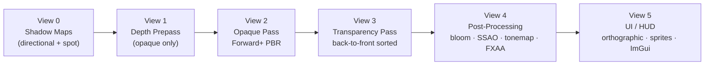
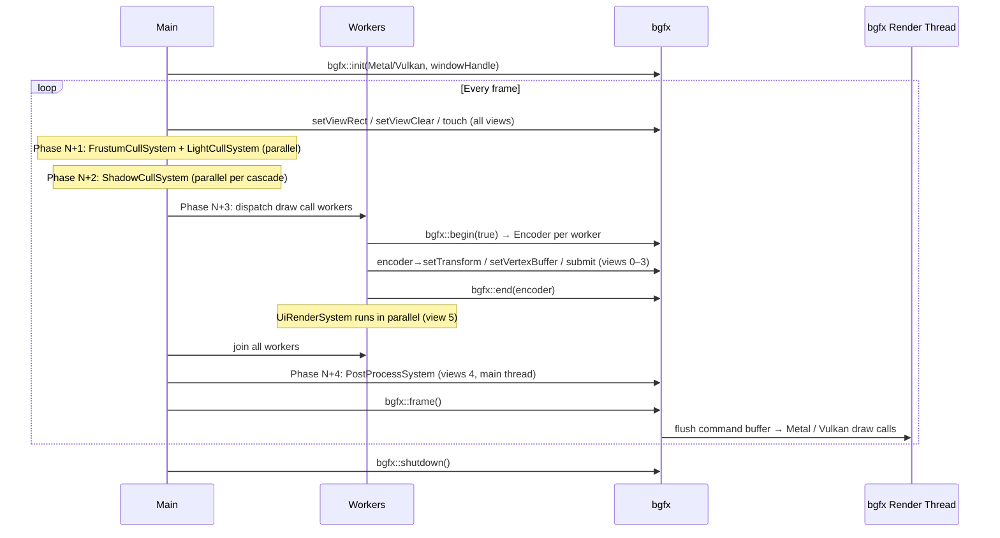
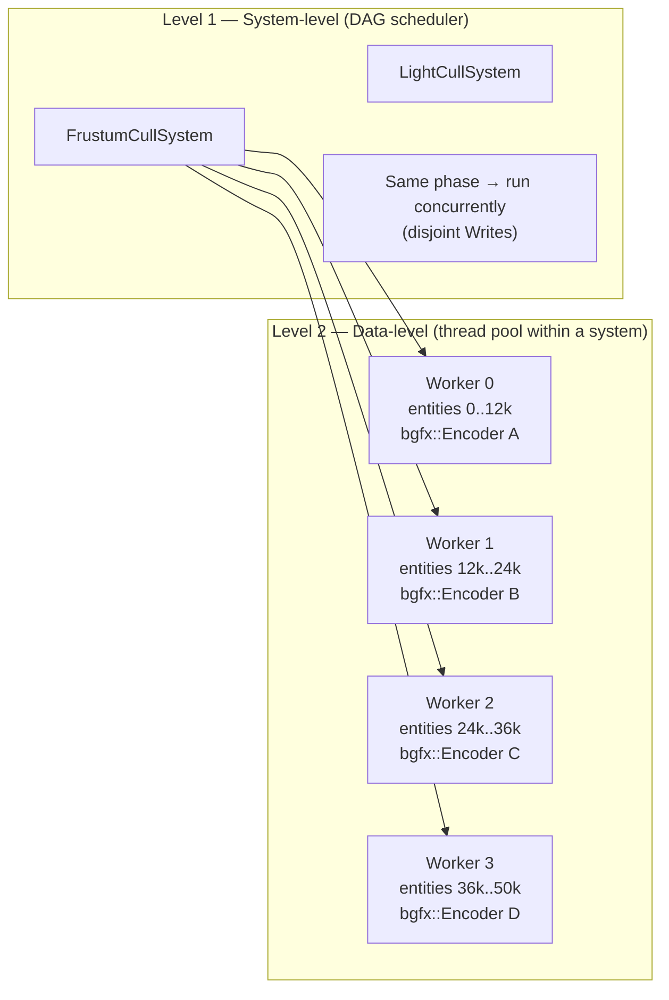
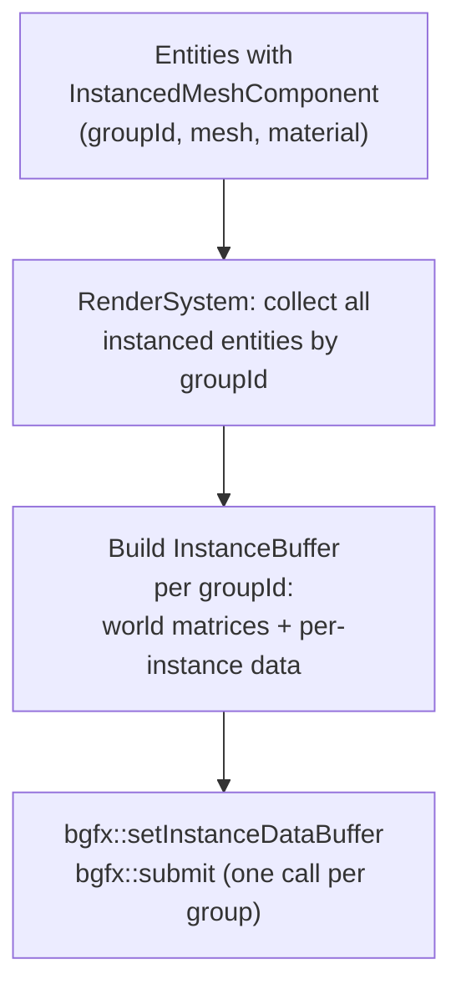
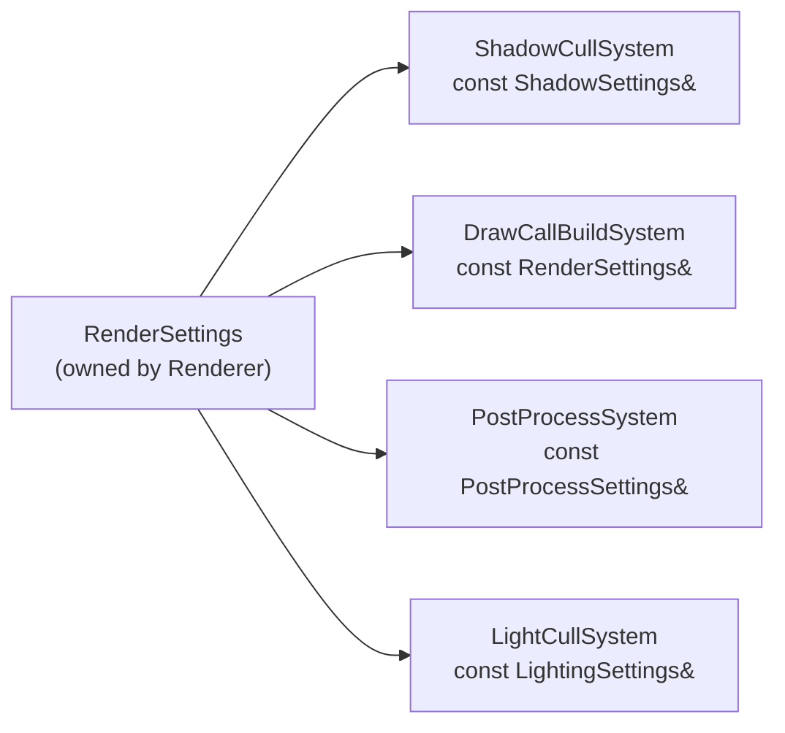
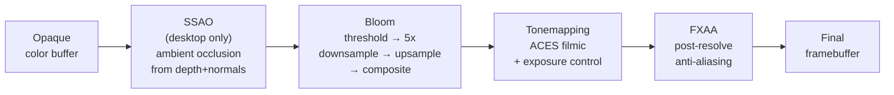

# Rendering Architecture

The renderer sits on top of **bgfx** (Metal + Vulkan backends only) and is driven by the ECS. It is not a self-contained subsystem — it is a set of systems and components that live in the same registry as everything else. The work is split across several focused systems that execute in ECS phases: transforms are updated, then visibility is culled and lights are assigned in parallel, then draw calls are recorded in parallel using bgfx encoders, then post-processing runs sequentially. bgfx's internal render thread consumes the resulting command buffer independently.

---

## Design Principles

- **ECS-driven.** Everything renderable is an entity with components. There is no separate scene representation.
- **Forward+.** Tiled clustered forward shading. Handles many dynamic lights, supports transparent objects naturally, works on mobile.
- **No render graph (yet).** Passes are a hardcoded linear pipeline. A proper render graph is the natural next step when the pipeline grows beyond ~6 passes — noted as a future upgrade.
- **PBR materials.** Physically-based rendering (albedo, roughness, metallic, normal, AO). One material format engine-wide.
- **bgfx views = passes.** Each render pass is a bgfx view. View IDs are fixed constants so pass ordering is explicit and easy to change.
- **Assets behind handles.** All GPU resources (meshes, textures, materials, shaders) are referenced by a typed `AssetHandle<T>`. The `RenderResources` registry maps handles to live bgfx handles.
- **Two levels of parallelism.** System-level: non-conflicting render systems run concurrently via the DAG scheduler. Data-level: individual systems (frustum cull, draw call recording) split their work across thread pool workers. bgfx encoders allow multiple threads to record draw calls simultaneously.
- **Configurable quality.** Every feature is individually toggleable and every scalable parameter (shadow resolution, cascade count, light budget, post-process quality) lives in a single `RenderSettings` struct. Systems read settings — nothing is hardcoded. Presets provide sensible per-platform defaults; games can override any value.

---

## System Overview

The render workload is split across five systems that map onto ECS phases. The DAG scheduler serializes phases with data dependencies and runs independent systems within a phase in parallel.



`FrustumCullSystem` and `LightCullSystem` have disjoint Writes so the DAG scheduler places them in the same phase and runs them concurrently. `UiRenderSystem` targets a different bgfx view and has no data conflict with `PostProcessSystem`, so they also run in parallel.

Within `FrustumCullSystem` and `DrawCallBuildSystem`, the thread pool is used for data-level parallelism — entity lists are partitioned across workers for culling and draw call encoding respectively.

---

## ECS Components

Every component is laid out to eliminate implicit padding. Fields are ordered to satisfy alignment naturally (largest alignment first, small fields grouped at the end). `static_assert` on `sizeof` and `offsetof` catches accidental regressions at compile time.

`AssetHandle<T>` is a `uint32_t` — 4 bytes, supports 4 billion unique assets.

### Tag Components

Tag components carry no data — entity presence in the SparseSet is the signal. The SparseSet specialises for empty types and allocates no dense array, so storing a tag on 50k entities costs only the sparse index array (50k × 4 bytes = 200 KB), not a dense data array.

```cpp
// Presence = visible to the main camera. Added/removed by FrustumCullSystem each frame.
struct VisibleTag {};
static_assert(sizeof(VisibleTag) == 1);

// cascadeMask: bit N set = entity is visible to shadow cascade N (up to 8 cascades).
// Set by ShadowCullSystem. DrawCallBuildSystem tests the relevant bit before recording
// a shadow draw call, avoiding work for entities not visible to a given cascade.
struct ShadowVisibleTag
{
    uint8_t cascadeMask;
};
static_assert(sizeof(ShadowVisibleTag) == 1);
```

### Camera

`ProjectionType` uses an explicit `uint8_t` underlying type. Without it the compiler defaults to `int` (4 bytes), creating a 3-byte hole between the floats and `viewLayer`.

```cpp
enum class ProjectionType : uint8_t { Perspective, Orthographic };

struct CameraComponent              // offset  size
{
    float          fovY;            //  0       4
    float          nearPlane;       //  4       4
    float          farPlane;        //  8       4
    float          aspectRatio;     // 12       4
    ProjectionType type;            // 16       1
    uint8_t        viewLayer;       // 17       1
    uint8_t        _pad[2];         // 18       2  (explicit — documents intent)
};                                  // total:  20 bytes
static_assert(sizeof(CameraComponent)         == 20);
static_assert(offsetof(CameraComponent, type) == 16);
```

### Mesh & Material

Handle-only components — one `uint32_t` each. Deliberately split so `FrustumCullSystem` can query `MeshComponent` for AABB bounds without touching `MaterialComponent`.

```cpp
struct MeshComponent     { uint32_t mesh;     }; // 4 bytes
struct MaterialComponent { uint32_t material; }; // 4 bytes
static_assert(sizeof(MeshComponent)     == 4);
static_assert(sizeof(MaterialComponent) == 4);
```

### Lights

`bool` has size 1 but alignment 1, so `bool castShadows` at offset 28 leaves 3 bytes of implicit padding to reach the next 4-byte boundary. Replacing it with `uint8_t flags` makes the padding explicit and reserves the remaining 7 bits for future toggles (receive shadows, affect specular, etc.).

```cpp
// Directional — one per scene (sun).
struct DirectionalLightComponent        // offset  size
{
    Vec3    direction;                  //  0      12
    Vec3    color;                      // 12      12
    float   intensity;                  // 24       4
    uint8_t flags;                      // 28       1  bit 0: castShadows
    uint8_t _pad[3];                    // 29       3
};                                      // total:  32 bytes
static_assert(sizeof(DirectionalLightComponent) == 32);

// Point — no angular attenuation.
struct PointLightComponent              // offset  size
{
    Vec3  color;                        //  0      12
    float intensity;                    // 12       4
    float radius;                       // 16       4
};                                      // total:  20 bytes
static_assert(sizeof(PointLightComponent) == 20);

// Spot — stores cos(innerAngle) and cos(outerAngle), not the raw angles.
// The shader computes dot(lightDir, fragDir) and compares to the precomputed cosines.
// Storing raw angles would require acos() per pixel on every lit fragment — eliminated here.
struct SpotLightComponent               // offset  size
{
    Vec3    direction;                  //  0      12
    Vec3    color;                      // 12      12
    float   intensity;                  // 24       4
    float   cosInnerAngle;              // 28       4  precomputed: cos(innerAngle)
    float   cosOuterAngle;              // 32       4  precomputed: cos(outerAngle)
    float   radius;                     // 36       4
};                                      // total:  40 bytes
static_assert(sizeof(SpotLightComponent) == 40);
```

### Instanced Mesh

```cpp
struct InstancedMeshComponent           // offset  size
{
    uint32_t mesh;                      //  0       4
    uint32_t material;                  //  4       4
    uint32_t instanceGroupId;           //  8       4
};                                      // total:  12 bytes
static_assert(sizeof(InstancedMeshComponent) == 12);
```

### Scene Graph (TransformSystem — not rendering-specific but used by all render systems)

`WorldTransformComponent` is 64 bytes / 16-byte aligned — one `Mat4`. This is the single hot read for `DrawCallBuildSystem`; keeping it at 64 bytes means exactly one cache line per entity's world transform.

```cpp
// Local TRS — written by game code, read by TransformSystem.
// dirty flag in bit 0 of flags; set when position/rotation/scale changes.
struct TransformComponent               // offset  size
{
    Vec3    position;                   //  0      12
    Quat    rotation;                   // 12      16
    Vec3    scale;                      // 28      12
    uint8_t flags;                      // 40       1  bit 0: dirty
    uint8_t _pad[3];                    // 41       3
};                                      // total:  44 bytes
static_assert(sizeof(TransformComponent)             == 44);
static_assert(offsetof(TransformComponent, rotation) == 12);

// World matrix — written by TransformSystem, read by all render systems.
// Mat4 is 16-byte aligned — SIMD-friendly, one cache line per entity.
struct WorldTransformComponent
{
    Mat4 matrix;                        // 64 bytes, offset 0
};
static_assert(sizeof(WorldTransformComponent) == 64);
```

---

**Renderable entity** = `MeshComponent` + `MaterialComponent` + `WorldTransformComponent`.
**Camera entity** = `CameraComponent` + `WorldTransformComponent`.
**Light entity** = one of the light components.

`WorldTransformComponent` is written by `TransformSystem`. All render systems read it — no transform logic lives in the renderer.

---

## Asset Types



All assets are loaded through the `AssetSystem` (streaming / asset cache layer). The `RenderResources` registry holds the live bgfx handles; assets themselves store metadata only.

---

## GPU Data Layout

Everything the GPU touches is laid out to minimise bandwidth: vertices are split into two streams so depth-only passes skip surface data entirely, attributes are packed to the smallest accurate representation, index buffers default to 16-bit, and texture formats are selected per-platform from `GpuFeatures` at load time.

### Vertex Streams

Meshes use **two vertex buffers** bound as separate streams. Depth-only passes (shadow maps, depth prepass) bind only Stream 0. The surface stream never enters the vertex fetch cache for those passes.

```
Stream 0 — Position only
┌──────────────────────────┐
│ float px, py, pz         │  12 bytes / vertex
└──────────────────────────┘

Stream 1 — Surface attributes
┌────────────────────────────────────────────────────────┐
│ snorm16 normalX, normalY  │  4 bytes  oct-encoded normal│
│ snorm8  tanX, tanY, tanZ  │           oct-encoded tangent│
│ snorm8  tanSign           │  4 bytes  bitangent handedness│
│ float16 u, v              │  4 bytes  UV coordinates    │
└────────────────────────────────────────────────────────┘
                               12 bytes / vertex
```

**Total: 24 bytes/vertex.** Naïve layout (float3 pos + float3 normal + float4 tangent + float2 UV) = 48 bytes/vertex — a 50% reduction in vertex fetch bandwidth.

**Normal/tangent encoding (oct):** A unit vector maps onto an octahedron, flattened to a square in [-1, 1]². Two `snorm16` values encode the normal; the shader reconstructs Z with `sqrt(1 - dot(xy, xy))` and a sign flip. Tangent is encoded the same way with an extra `snorm8` for bitangent handedness. Precision loss is visually imperceptible for normal maps.

**UV precision:** `float16` gives ~3 decimal digits of precision — sufficient for UV coordinates in the range [0, 1] and for typical 0–8× tiling. If a mesh needs sub-texel precision at high tiling factors, the importer falls back to `float32` for that mesh's Stream 1.

**bgfx vertex layout declarations:**

```cpp
// engine/rendering/VertexLayouts.h

inline bgfx::VertexLayout positionLayout()
{
    bgfx::VertexLayout l;
    l.begin()
     .add(bgfx::Attrib::Position, 3, bgfx::AttribType::Float)
     .end();
    return l;  // stride: 12 bytes
}

inline bgfx::VertexLayout surfaceLayout(const GpuFeatures& gpu)
{
    bgfx::VertexLayout l;
    l.begin()
     .add(bgfx::Attrib::Normal,    2, bgfx::AttribType::Int16, /*normalized=*/true)
     .add(bgfx::Attrib::Tangent,   4, bgfx::AttribType::Int8,  /*normalized=*/true)
     .add(bgfx::Attrib::TexCoord0, 2,
          gpu.halfPrecisionAttribs ? bgfx::AttribType::Half : bgfx::AttribType::Float)
     .end();
    return l;  // stride: 12 bytes (half UV) or 16 bytes (float UV fallback)
}
```

The `GpuFeatures` check on UV type is the only per-platform branch in the vertex layout. All other attributes are universally supported by Metal and Vulkan.

**Skinned meshes** add a third stream (Stream 2) — bone indices (`uint8_t × 4`) and bone weights (`unorm8 × 4`) — 8 bytes/vertex. Bound only for skinned draw calls; static geometry never pays for it.

### Index Buffers

16-bit indices (65 535 max vertices per mesh) are the default — half the memory and bandwidth of 32-bit. The importer checks vertex count at build time and emits `BGFX_BUFFER_INDEX_32` only when the mesh genuinely exceeds 65 535 vertices. Most game meshes don't.

```cpp
const bool needs32bit = vertexCount > 65535u;
const uint16_t flags  = needs32bit ? BGFX_BUFFER_INDEX_32 : BGFX_BUFFER_NONE;
mesh.ibh = bgfx::createIndexBuffer(mem, flags);
```

### Mesh Optimisation Pipeline

Applied offline by the asset importer (not at runtime) using **meshoptimizer** (~100 KB, MIT):

```
Raw mesh (from glTF / FBX)
        │
        ▼
1. Weld duplicate vertices
        │
        ▼
2. Vertex cache optimisation   — Forsyth reorder, maximises post-transform cache hits
        │
        ▼
3. Overdraw optimisation       — reorder triangles to reduce pixel overdraw (threshold: 1.05)
        │
        ▼
4. Vertex fetch optimisation   — remap vertices to match draw order, maximises prefetch
        │
        ▼
5. Attribute packing           — encode normals/tangents to oct, UVs to float16
        │
        ▼
6. Meshlet generation          — compute meshlets for future GPU-driven culling (stored, unused now)
        │
        ▼
Packed binary mesh file (assets/meshes/*.nmesh)
```

Steps 2–4 are three orthogonal passes in meshoptimizer (`optimizeVertexCache`, `optimizeOverdraw`, `optimizeVertexFetch`). Running all three takes ~10 ms per mesh on a desktop — fine for offline import, never acceptable at runtime.

### Uniform and Constant Buffer Packing

bgfx uses `Vec4` as the minimum uniform unit — a single `float` still occupies a full 16-byte slot. Packing rules:

**Per-frame constants** (set once per frame, shared across all draw calls in a view):

```
u_frameParams [Vec4 × 2]
  .xy  = viewport size (pixels)
  .zw  = { near, far }
  [1].xyzw = time, deltaTime, 0, 0
```

**Per-material constants** (set once per material batch):

```
u_material [Vec4 × 2]
  [0].rgb  = albedo
  [0].a    = roughness
  [1].r    = metallic
  [1].gba  = emissive RGB
```

**Light data** (uploaded as a `Vec4` array before the opaque pass, indexed in the cluster list):

```
u_lights [Vec4 × 3 per light, max 256 lights]
  [0].xyz  = world position (point/spot) or direction (directional)
  [0].w    = radius
  [1].rgb  = colour × intensity (pre-multiplied)
  [1].w    = type (0=point, 1=spot, 2=directional)
  [2].xyz  = spot direction
  [2].w    = cos(outerAngle)  ← matches SpotLightComponent precomputation
```

Keeping the `cos(outerAngle)` from `SpotLightComponent` already precomputed means the CPU just copies it directly into the uniform array — no per-frame trig.

### Texture Compression

Textures are compressed offline at import time. The engine selects the right binary at load time based on `GpuFeatures`:

| Texture role | Mac / iOS (Metal) | Windows (Vulkan) | Android modern | Android legacy |
|---|---|---|---|---|
| Albedo (sRGB) | ASTC 4×4 | BC7 | ASTC 4×4 | ETC2 RGB8 |
| Normal map (linear, 2-channel) | ASTC 4×4 | BC5 | ASTC 4×4 | ETC2 RG11 |
| ORM (occlusion/roughness/metallic) | ASTC 4×4 | BC7 | ASTC 4×4 | ETC2 RGB8 |
| HDR environment (linear float) | ASTC HDR 6×6 | BC6H | ASTC HDR 6×6 | RGBA16F (uncompressed) |

BC5 for normal maps stores only RG and lets the shader reconstruct B — better quality per byte than BC7 for 2-channel data.

Each texture asset ships with multiple compressed variants in the same `.ntex` file. The asset loader reads `GpuFeatures.preferredTextureFormat` and picks the matching variant.

### GPU Feature Detection

`GpuFeatures` is populated once at startup from `bgfx::getCaps()` and passed by `const` reference wherever rendering decisions depend on hardware capability.

```cpp
// engine/rendering/GpuFeatures.h

struct GpuFeatures
{
    // Vertex attributes
    bool halfPrecisionAttribs;   // AttribType::Half supported (float16 UVs)
    bool uint10Attribs;          // AttribType::Uint10 supported (RGB10A2 — alternative packing)

    // Texture formats
    bool textureBC;              // BC1–BC7 (desktop)
    bool textureASTC;            // ASTC LDR + HDR (Apple, modern Android)
    bool textureETC2;            // ETC2 (Android fallback)
    bool textureShadowCompare;   // BGFX_CAPS_TEXTURE_COMPARE_LEQUAL — PCF shadow sampling
    bool textureBC6H;            // BC6H — HDR environment maps (desktop)

    // Rendering features
    bool computeShaders;         // BGFX_CAPS_COMPUTE — GPU-driven culling path (future)
    bool indirectDraw;           // BGFX_CAPS_DRAW_INDIRECT — GPU-driven instances (future)
    bool instancing;             // BGFX_CAPS_INSTANCING — hardware instancing

    // Limits
    uint32_t maxTextureSize;     // caps shadow map and environment map resolution
    uint32_t maxDrawCalls;       // hard per-frame budget reported by bgfx

    // Preferred compressed format for this device (resolved at startup)
    enum class TextureFormat : uint8_t { ASTC, BC, ETC2, Uncompressed } preferredTextureFormat;

    static GpuFeatures query();  // calls bgfx::getCaps() and populates the struct
};
```

`RenderSettings::platformDefault()` reads `GpuFeatures` when constructing defaults — e.g., `maxTextureSize` caps `ShadowSettings::directionalRes` so a device that only supports 2048² textures never tries to allocate a 4096² shadow map.

---

## bgfx Limitations and Modification Assessment

bgfx covers everything needed for the base architecture without modification. Two features would require forking bgfx and are deferred until profiling justifies the cost:

| Feature | Status | Notes |
|---|---|---|
| Packed vertex attributes (half, snorm16, snorm8) | **Supported natively** | `AttribType::Half`, `Int16`, `Int8` — no changes needed |
| 16-bit index buffers | **Supported natively** | `BGFX_BUFFER_NONE` default |
| Per-GPU feature caps | **Supported natively** | `bgfx::getCaps()` covers all needed flags |
| Multi-stream vertex buffers | **Supported natively** | Multiple `bgfx::setVertexBuffer` calls per draw |
| Compressed texture formats | **Supported natively** | `BGFX_TEXTURE_FORMAT_BC*`, `ASTC*`, `ETC2*` |
| **Bindless textures** | **Not supported** | Would need bgfx fork + Vulkan `VK_EXT_descriptor_indexing` + Metal argument buffers. Workaround: sort draw calls by material (already in sort key). Trigger: profiling shows material rebinding is a CPU bottleneck |
| **Push constants / root constants** | **Not exposed** | bgfx uses UBO path for all uniforms. Push constants would reduce per-draw CPU overhead on mobile. Trigger: profiling shows uniform binding is a bottleneck at high draw counts |
| GPU-driven indirect draw with variable count | **Partial** | `BGFX_CAPS_DRAW_INDIRECT` exists; `drawIndirectCount` (variable GPU-generated count) not supported. Needed for full GPU-driven culling. Trigger: instance count exceeds ~100k |

**No bgfx modifications are needed to ship the base renderer.** The bindless and push-constant gaps are real but only matter at draw counts and material counts well above the initial target. Both are profiling-triggered decisions.

---

## Render Pipeline



### View 0 — Shadow Maps

- Skipped entirely if `ShadowSettings.enabled = false`.
- One shadow map per directional light (CSM), one per active spot light.
- Resolution: `ShadowSettings.directionalRes` × `ShadowSettings.directionalRes` for directional (default 2048²), `ShadowSettings.spotRes` for spot (default 1024²). Both are power-of-two and configurable at runtime.
- Cascade count: `ShadowSettings.cascadeCount` (1–4, default 3).
- Depth-only render: no color attachment.
- Output: shadow map textures sampled in the opaque pass.

### View 1 — Depth Prepass

- Renders only opaque geometry to populate the depth buffer.
- Eliminates overdraw in the opaque pass (especially important for dense foliage/terrain).
- Can be disabled on mobile if the prepass cost exceeds the overdraw cost (GPU-dependent, profile-driven).

### View 2 — Opaque Pass (Forward+)

- All opaque, non-instanced geometry.
- Light data passed as a uniform buffer (point/spot lights, up to 256 active lights).
- Clustered culling: view frustum divided into a 3D grid of tiles; each tile knows which lights affect it. Computed once on CPU per frame before submission.
- Reads shadow maps from View 0 for shadow-receiving surfaces.
- PBR shader: GGX specular, Lambert diffuse, IBL ambient, shadow PCF.

### View 3 — Transparency Pass

- Alpha-blended and alpha-tested geometry.
- Sorted back-to-front by depth (camera distance) each frame.
- No depth writes. Reads depth buffer from View 1/2 for soft particle depth tests.

### View 4 — Post-Processing Chain

Each post effect is a full-screen quad blit in its own sub-pass. Each is independently toggled by `PostProcessSettings`:

| Effect | Controlled by | Default (desktop / mobile) |
|---|---|---|
| SSAO | `ssao.enabled`, `ssao.sampleCount` | on 16 samples / off |
| Bloom | `bloom.enabled`, `bloom.intensity`, `bloom.downsampleSteps` | on / off |
| Tonemapping | `toneMapper`, `exposure` | ACES, 1.0 / same |
| FXAA | `fxaaEnabled` | on / on |

### View 5 — UI / HUD

- Orthographic projection. All 2D sprites and UI panels render here.
- ImGui rendered last in this pass (editor mode) or suppressed (shipped game).
- Depth test disabled — UI always draws on top.

---

## bgfx Integration



### bgfx Encoder Rules

bgfx encoders allow worker threads to record draw calls concurrently into separate command buffers that bgfx merges before `bgfx::frame()`.

| Operation | Thread | Reason |
|---|---|---|
| `bgfx::init` / `bgfx::shutdown` | Main only | One-time lifecycle |
| `bgfx::frame()` | Main only | Synchronization point |
| `bgfx::setViewRect` / `setViewClear` / `touch` | Main only | View state is global |
| GPU resource creation (`createVertexBuffer`, `createTexture`, …) | Main only | bgfx resource API not thread-safe |
| `bgfx::begin(true)` / encoder calls / `bgfx::end` | Any worker thread | Safe — each encoder is independent |
| Post-process full-screen submits (views 4) | Main thread encoder | Sequential dependency on prior passes |

---

## Threading Model

### Two Levels of Parallelism



**Level 1** is handled by the DAG scheduler automatically from the Reads/Writes declarations on each system. No manual coordination needed — systems with disjoint writes land in the same phase and run on separate thread pool threads.

**Level 2** is explicit within a system. `FrustumCullSystem` and `DrawCallBuildSystem` partition their entity lists into N chunks (N = thread count) and submit tasks to the `ThreadPool`. Each draw call worker holds its own `bgfx::Encoder` for the duration of its task.

### What Is and Isn't Parallelized

| Work | Parallel? | How |
|---|---|---|
| Frustum cull (main camera) | Yes | Data-parallel — entity list split across workers |
| Shadow frustum cull | Yes | One task per cascade + spot light (system-level) |
| Clustered light list building | Yes | Data-parallel — tile grid split across workers |
| Instance buffer construction | Yes | One task per instance group |
| Draw call recording (opaque, shadow, transparent) | Yes | N workers, each with a bgfx::Encoder |
| Post-processing passes | No | Each pass reads the previous pass output |
| UI / sprite rendering | Yes (with post-process) | Different bgfx view — no data conflict |
| GPU resource upload (mesh, texture) | No | bgfx resource API is main-thread only; use staging queue |
| bgfx::frame() | No | Main-thread synchronization point |

### Staging Queue for Async Asset Upload

GPU resource creation (`bgfx::createVertexBuffer`, `bgfx::createTexture`) is main-thread only. When the asset system finishes loading a mesh or texture on a background thread, it pushes a `PendingUpload` to a thread-safe queue. At the start of each frame (before view setup), the main thread drains this queue and calls the bgfx create functions. This keeps worker threads free of main-thread-only bgfx calls while still feeding the GPU promptly.

### Platform-specific init:

| Platform | Backend | Window handle |
|---|---|---|
| Mac | Metal | `NSWindow*` (wrapped in `bgfx::PlatformData`) |
| iOS | Metal | `CAMetalLayer*` |
| Windows | Vulkan | `HWND` |
| Android | Vulkan | `ANativeWindow*` |

---

## Shader Pipeline

bgfx uses **shaderc** — shaders are written in a GLSL-like dialect and compiled offline to Metal Shader Language (Metal) or SPIR-V (Vulkan). No runtime compilation.

```
engine/rendering/shaders/
├── common/
│   ├── uniforms.sh       — shared uniform declarations
│   └── pbr.sh            — PBR lighting functions (GGX, Lambert, IBL)
├── pbr/
│   ├── vs_pbr.sc         — PBR vertex shader
│   └── fs_pbr.sc         — PBR fragment shader
├── shadow/
│   ├── vs_shadow.sc      — depth-only vertex shader
│   └── fs_shadow.sc      — depth-only fragment shader (empty)
├── post/
│   ├── vs_fullscreen.sc  — full-screen triangle vertex shader
│   ├── fs_bloom.sc
│   ├── fs_ssao.sc
│   ├── fs_tonemap.sc
│   └── fs_fxaa.sc
└── ui/
    ├── vs_sprite.sc
    └── fs_sprite.sc
```

**Build step:** A CMake custom command runs shaderc on all `.sc` files and outputs compiled shader binaries into `assets/shaders/`. The engine loads these binaries at startup via the asset system. Shaders are never compiled at runtime.

**Platform targets compiled per shader:**
- `--platform osx --type metal` → `.bin` for Metal
- `--platform android --type spirv` → `.bin` for Vulkan

Both are packaged and the engine selects the correct binary based on the active bgfx backend.

---

## GPU Instancing

For vegetation, foliage, rocks, and other high-count repeated meshes. A single draw call renders thousands of instances.



- Instances are grouped by `(mesh, material)` pair — one draw call per unique pair.
- The instance buffer is rebuilt from ECS data each frame (dynamic, CPU-side).
- Buffer construction is parallel: `InstanceBufferBuildSystem` submits one thread pool task per group — groups are fully independent.
- Once GPU-driven culling is needed (1M+ instances), this becomes a compute shader — noted as future work.

---

## Render Settings & Quality Scaling

All rendering behaviour is controlled by a single `RenderSettings` struct passed by `const` reference to every render system. Nothing in the renderer is hardcoded. Features can be toggled per-frame; scalable parameters take effect on the next frame with no GPU work except where noted.

### The RenderSettings Struct

```cpp
// engine/rendering/RenderSettings.h

enum class ShadowFilter { Hard, PCF4x4, PCF8x8 };
enum class ToneMapper   { ACES, Reinhard, Uncharted2 };

struct ShadowSettings
{
    bool     enabled              = true;
    uint16_t directionalRes       = 2048;  // power of two: 512 / 1024 / 2048 / 4096
    uint16_t spotRes              = 1024;
    uint8_t  cascadeCount         = 3;     // 1 – 4
    float    maxDistance          = 150.0f;
    ShadowFilter filter           = ShadowFilter::PCF4x4;
};

struct SsaoSettings
{
    bool    enabled     = true;
    float   radius      = 0.5f;
    float   bias        = 0.025f;
    uint8_t sampleCount = 16;   // 8 / 16 / 32
};

struct BloomSettings
{
    bool    enabled        = true;
    float   threshold      = 1.0f;
    float   intensity      = 0.04f;
    uint8_t downsampleSteps = 5;   // 3 / 4 / 5
};

struct PostProcessSettings
{
    SsaoSettings  ssao;
    BloomSettings bloom;
    bool          fxaaEnabled  = true;
    ToneMapper    toneMapper   = ToneMapper::ACES;
    float         exposure     = 1.0f;
};

struct LightingSettings
{
    uint16_t maxActiveLights = 256;   // capped by cluster uniform buffer size
    bool     iblEnabled      = true;
};

struct RenderSettings
{
    ShadowSettings      shadows;
    LightingSettings    lighting;
    PostProcessSettings postProcess;
    bool                depthPrepassEnabled  = true;
    uint8_t             anisotropicFiltering = 8;   // 1 / 4 / 8 / 16
    float               renderScale          = 1.0f; // 0.5 – 1.0 (internal resolution)

    // Factory: returns appropriate defaults for the current platform.
    static RenderSettings platformDefault();
};
```

Sub-structs group related knobs so systems only take the slice they need (e.g. `ShadowCullSystem` takes `const ShadowSettings&`).

### Quality Presets

Presets are plain factory functions returning a `RenderSettings` value. They are not an enum the struct carries — the game starts from a preset and overrides individual fields freely.

```cpp
namespace RenderPresets
{
    RenderSettings ultraDesktop();    // 4096 shadows, 4 cascades, PCF8x8, SSAO 32 samples
    RenderSettings highDesktop();     // 2048 shadows, 3 cascades, PCF4x4, SSAO 16 samples
    RenderSettings mediumDesktop();   // 1024 shadows, 2 cascades, PCF4x4, SSAO off
    RenderSettings lowDesktop();      // 512 shadows,  1 cascade,  Hard,   SSAO off, no bloom
    RenderSettings highMobile();      // 1024 shadows, 2 cascades, Hard,   SSAO off
    RenderSettings mediumMobile();    // 512 shadows,  1 cascade,  Hard,   SSAO off, bloom off
    RenderSettings lowMobile();       // shadows off, SSAO off, bloom off, render scale 0.75
}
```

**Platform defaults** (returned by `RenderSettings::platformDefault()`):

| Platform | Default preset | Rationale |
|---|---|---|
| Mac (desktop) | `highDesktop` | Metal, capable GPU |
| Windows | `highDesktop` | Vulkan, capable GPU |
| iOS | `highMobile` | Metal, thermal constraints |
| Android | `mediumMobile` | Wide hardware variance; conservative default |

Games can override at startup and expose a quality menu to players:

```cpp
RenderSettings settings = RenderSettings::platformDefault();
settings.shadows.directionalRes = 1024;  // this game has close-range combat, lower res is fine
settings.postProcess.bloom.intensity = 0.08f;
renderer.applySettings(settings);
```

### How Systems Consume Settings

Each system receives a `const RenderSettings&` (or the relevant sub-struct) on its `update()` call. The struct is owned by the `Renderer` and does not live in the ECS.



If a feature is disabled, the system that owns it short-circuits immediately and does no work — no special-casing at the call site.

### Settings Changes at Runtime

Most changes take effect on the next frame with no GPU work. Two settings require GPU resource re-allocation and trigger a brief one-frame stall:

| Setting changed | GPU impact | Handled by |
|---|---|---|
| `shadows.directionalRes` / `spotRes` | Shadow map textures must be re-created | `RenderResources` detects size mismatch, destroys and recreates on next frame |
| `renderScale` | Internal framebuffer must be re-created | Same — framebuffer resize |
| All other settings | No GPU work | Take effect next `update()` call |

Re-allocations are done at the start of the frame before any views are set up, so the frame that applies the change renders correctly.

### Serialization

`RenderSettings` serializes to / from JSON so settings can be saved to a player config file and reloaded on next launch. JSON parser to be decided under the external library policy (nlohmann/json or rapidjson — see Scene Graph section in NOTES.md). Binary format is not needed here — settings files are small and only read at startup.

---

## Lighting Model

**Ambient:** Image-based lighting (IBL) — a prefiltered environment cubemap + BRDF LUT. One IBL per scene; blended between two IBLs in transition zones.

**Directional:** Sun light. One per scene. Casts cascaded shadow maps. Cascade count and shadow distance come from `ShadowSettings` — 1–4 cascades, configurable split lambda.

**Point / Spot:** Dynamic, clustered. Active light budget set by `LightingSettings.maxActiveLights` (default 256, lower on mobile). The clustered grid is 16×9×24 tiles (matches 16:9 viewport, 24 depth slices). Per-tile light lists are computed on CPU and uploaded as a uniform buffer before the opaque pass.

**Emissive:** Materials can have an emissive color + intensity. No light is emitted (no lightmaps), purely a visual additive contribution.

**Future — lightmaps / light probes:** Static geometry can be baked offline and stored as light probe volumes. Not in scope for the initial renderer.

---

## Post-Processing



Each effect is a full-screen pass. `PostProcessSystem` skips any disabled pass entirely — no GPU draw call is issued. The in-game visualiser can toggle passes live via `RenderSettings` without restarting.

---

## 2D / UI Layer (View 5)

Rendered last, on top of everything. Orthographic projection — no depth test.

**Sprites:** A sprite is a quad mesh (two triangles) with a texture region. The `SpriteComponent` holds a texture handle + UV rect. `SpriteRenderSystem` batches all sprites sharing the same texture atlas into a single draw call per atlas.

**ImGui:** Rendered in View 5 in editor mode. In shipped builds, the ImGui render step is compiled out (`#ifndef NIMBUS_EDITOR`).

---

## RenderResources Registry

Maps typed asset handles to live bgfx handles. Owns all GPU resource lifetime.

```cpp
// engine/rendering/RenderResources.h
class RenderResources
{
public:
    bgfx::VertexBufferHandle  getMesh(AssetHandle<Mesh>) const noexcept;
    bgfx::TextureHandle       getTexture(AssetHandle<Texture>) const noexcept;
    bgfx::ProgramHandle       getShader(AssetHandle<Shader>) const noexcept;

    void uploadMesh(AssetHandle<Mesh>, const MeshData&);
    void uploadTexture(AssetHandle<Texture>, const TextureData&);
    void uploadShader(AssetHandle<Shader>, const ShaderData&);

    void release(AssetHandle<Mesh>);
    void release(AssetHandle<Texture>);
    void release(AssetHandle<Shader>);
};
```

Called by the asset system when a mesh/texture/shader finishes loading. Release called when the asset is evicted from the cache.

---

## Draw Call Sort Order

Within each pass, draw calls are sorted to minimise GPU state changes:

**Opaque pass sort key (64-bit, most significant first):**
1. Shader program ID — state changes are most expensive
2. Texture set hash — texture binding changes
3. Depth (front-to-back) — early-z rejection (less important after depth prepass, still useful)

**Transparency pass sort key:**
1. Depth (back-to-front) — required for correct blending

bgfx accepts a 64-bit sort key on `bgfx::submit()`; we pack our sort key into it directly.

---

## Implementation Plan

The renderer is built in phases, each independently shippable:

| Phase | What | Dependency |
|---|---|---|
| 1 | bgfx init + window integration, clear screen | Platform layer |
| 1b | `RenderSettings` struct, presets, `platformDefault()` | Phase 1 |
| 2 | Mesh upload, unlit draw call, camera | Math library ✓ |
| 3 | PBR material + directional light (no shadows) | Phase 2 |
| 4 | Shadow maps (directional, single cascade) | Phase 3 |
| 5 | Instanced mesh rendering | Phase 2 |
| 6 | Point + spot lights (clustered) | Phase 3 |
| 7 | Post-processing (bloom, tonemap, FXAA) | Phase 3 |
| 8 | SSAO | Phase 7 |
| 9 | CSM (3-cascade shadows) | Phase 4 |
| 10 | 2D sprite batching + UI pass | Phase 2 |
| 11 | IBL (environment cubemap) | Phase 3 |

---

## Open / Deferred Decisions

| Topic | Decision |
|---|---|
| Render graph | Hardcoded linear pipeline for now; render graph when pass count or resource dependencies become unwieldy |
| TAA (Temporal Anti-Aliasing) | Deferred — requires jitter + reprojection; FXAA ships first |
| Decals | Not in initial scope |
| Terrain renderer | Separate concern — heightfield + clipmap LOD; design when first game needs it |
| GPU-driven rendering (compute culling, indirect draw) | Future — triggers when instanced mesh count exceeds ~100k and CPU bottleneck is confirmed |
| Lightmaps / light probes | Deferred — static bake pipeline is significant work; dynamic lights only first |
| Ray tracing | Long-term — tabled (see NOTES.md Rendering section) |
